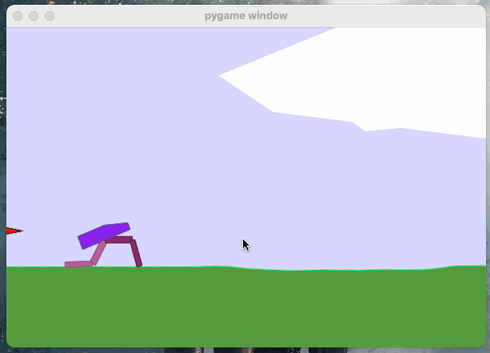
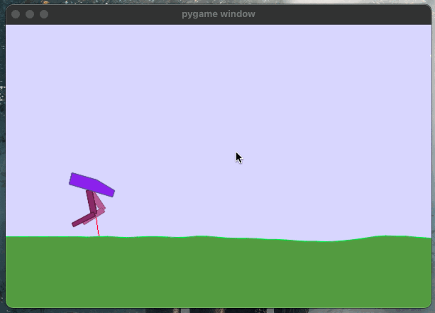
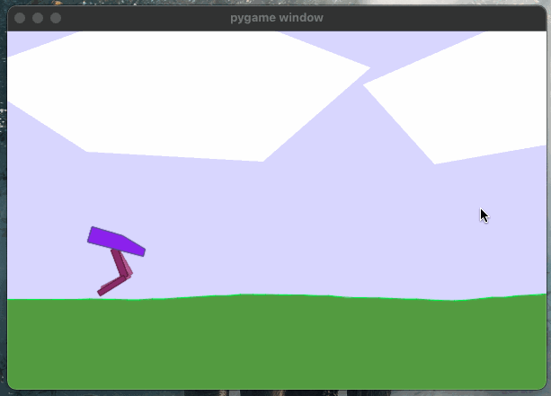
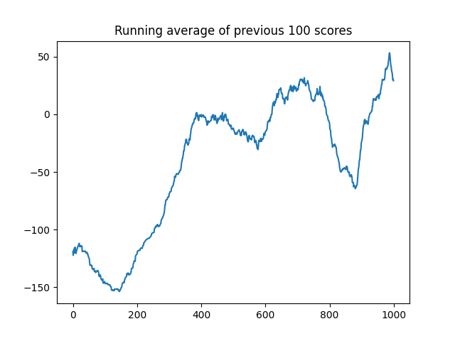

# learn to walk using deep reinforcement learning
This is an implementation of the Deep Deterministic Gradient Policy which is a type of actor critic policy.

## Progress clips
After 40 episodes of training  

After 260 episodes of training  

After 1000 episodes  

Overall the training process took about 8 hrs to complete 1000 episodes.  
The learning curve for 1000 episodes is plotted in the diagram below:

